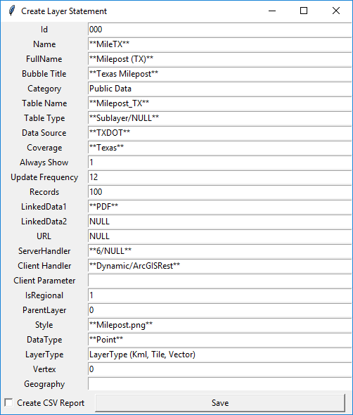

# Layer-SQL

## Dependencies
* Python 3
* Tkinter
* pyodbc

This project provides multiple database management tools for the uGRIDD GIS team. These tools aid in the creation of new uFIND layer tables within the uGRIDD Azure Database.

## layer_statement.py

The layer statement utility provides a graphical user interface for providing values to be used in the layer.sql statment. Default values are provided, but should be replaced.

Clicking save creates a .sql file as chosen by the user. If "Create CSV Report" is selected, an accompanying csv will 

GUI package: Tkinter

Asterisks indicate placeholder values that must be replaced. Placeholders are intended to aid the user as a reference to common values in the Layer table.

## table_design.py

table_design.py seeks to speed up the SQL table design process when creating a new uFIND layer table. 

### Flow:
* Prompt user for output file location
* Prompt user for test server password (to ensure this is not publicly on GitHub)
* Prompt user for table name 
* Assure table is in database
* Provide the following values for every column:
  * Column header
  * If has NULL values
  * Min characters
  * Max characters
  * List of unique values
* Change all empty ('') values in table to NULL + commit

## client_parameter.py
The client parameter tool is an aid to the layer statement utility. ClientParameter is a field in the Layer table that is used when a third party layer is selected for uFIND. 

### REST Query Flow:
* Ask user if REST Query or Tile Export
* Prompt user for /query URL
* Prompt user for geometry type (point, polygon, line) and verify input
* Prompt user for Title field
* Prompt user for uGRIDD Bubble field names
* Based on # of uGRIDD Bubble fields, prompt user for both source field names and field definition (atr, link)
* Prompt user for style based on geometry type
* Ouput generated

### Export Flow:
* Ask user if REST Query or Tile Export
* Prompt user for Name
* Prompt user for geometry type (point, polygon, line) and verify input
* Prompt user for unique ID field name
* Prompt user for bounding coordinates in WGS84 (West, South, East, North)
* Prompt user for /export URL
* Prompt user for /query URL
* Prompt user for uGRIDD Bubble field names
* Based on # of uGRIDD Bubble fields, prompt user for both source field names and field definition (atr, link)
* Prompt user for style based on geometry type
* Ouput generated

## Author

* **John Carlee** - JCarlee@gmail.com
